# PROYECTO 1 — NetCore Academy

---

**Institución:** Universidad San Carlos de Guatemala  
**Facultad:** Ingeniería en Ciencias y Sistemas  
**Curso:** Redes de Computadoras 1  
**Autor:** Ángel Rafael Barrios González  
**Carnet:** 202300733  
**Fecha:** 20 de marzo de 2026  

---

## Índice

1. [Introducción](#introducción)
2. [Topología General](#topología-general)
3. [Topología por Edificio](#topología-por-edificio)
4. [Tabla de VLANs](#tabla-de-vlans)
5. [Tabla de Dominios de Colisión](#tabla-de-dominios-de-colisión)
6. [Tabla de Dominios de Broadcast](#tabla-de-dominios-de-broadcast)
7. [Jerarquía de Medios e Interfaces](#jerarquía-de-medios-e-interfaces)
8. [Configuración VTP](#configuración-vtp)
9. [Configuración STP](#configuración-stp)
10. [Configuración EtherChannel](#configuración-etherchannel)
11. [Configuración de Trunks](#configuración-de-trunks)
12. [Tabla de Direccionamiento IP](#tabla-de-direccionamiento-ip)
13. [Comandos por Dispositivo](#comandos-por-dispositivo)
14. [Pruebas de Conectividad](#pruebas-de-conectividad)
15. [Presupuesto Estimado](#presupuesto-estimado)
16. [Conclusión](#conclusión)

---

## Introducción

El presente proyecto corresponde al diseño e implementación de la infraestructura de red del campus académico ficticio **NetCore Academy**, desarrollado como parte del curso de Redes de Computadoras 1 de la Universidad San Carlos de Guatemala.

El campus opera con una arquitectura distribuida en cuatro edificios (A, B, C y D), interconectados mediante un backbone de fibra óptica OM3 (100Base-FX). El objetivo principal es solucionar el problema de una red plana sin segmentación, implementando tecnologías de capa 1 y capa 2 del modelo OSI, incluyendo:

- **VLANs** para segmentación lógica del tráfico
- **VTP** para distribución centralizada de VLANs
- **STP (Rapid-PVST)** para redundancia y prevención de bucles
- **EtherChannel (PAgP y LACP)** para agregación de enlaces
- **Cableado estructurado jerárquico** con fibra óptica y cobre UTP

La implementación se realizó en **Cisco Packet Tracer 8.0**, utilizando switches Cisco 2960-24TT y Switch-PT con módulos de fibra óptica PT-SWITCH-NM-1FFE.

---

## Topología General

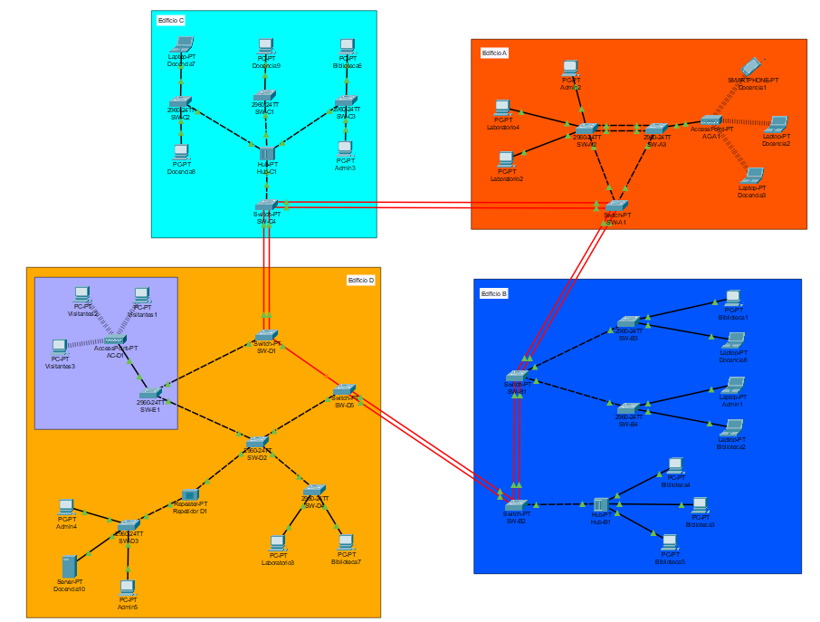

La topología del campus conecta los cuatro edificios de la siguiente manera:

```
                    SW-A1 (Edificio A)
                   /        \
            SW-B1            SW-C4
           /    \              \
        SW-B2   SW-B3/B4      Hub-C1
           \                 /  |  \
           SW-D5           SW-C1 SW-C2 SW-C3
              \
              SW-D1 (Edificio D)
```

**Conexiones inter-edificios (EtherChannel PAgP sobre fibra OM3):**

| Enlace | Protocolo | Puertos origen | Puertos destino |
|--------|-----------|----------------|-----------------|
| SW-A1 ↔ SW-B1 | EtherChannel PAgP | Fa4/1, Fa7/1 | Fa4/1, Fa6/1 |
| SW-A1 ↔ SW-C4 | EtherChannel PAgP | Fa5/1, Fa6/1 | Fa4/1, Fa6/1 |
| SW-C4 ↔ SW-D1 | EtherChannel PAgP | Fa5/1, Fa7/1 | Fa5/1, Fa6/1 |
| SW-D5 ↔ SW-B2 | EtherChannel PAgP | Fa4/1, Fa6/1 | Fa5/1, Fa7/1 |
| SW-B1 ↔ SW-B2 | EtherChannel PAgP | Fa5/1, Fa7/1 | Fa4/1, Fa6/1 |
| SW-D1 ↔ SW-D5 | Trunk 802.1Q simple | Fa4/1 | Fa5/1 |

---

## Topología por Edificio

### Edificio A

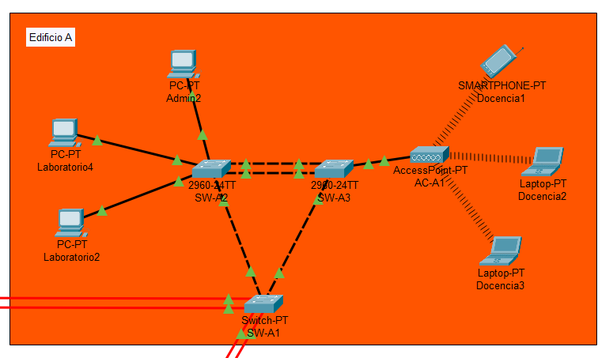

**Dispositivos:**
- SW-A1 (Switch-PT) — Switch de distribución con conexión de fibra al campus
- SW-A2 (2960-24TT) — Switch de acceso
- SW-A3 (2960-24TT) — Switch de acceso con Access Point
- AC-A1 — Access Point (SSID: EdificioA)
- Admin2, Laboratorio2, Laboratorio4 — PCs
- Docencia1 (Smartphone), Docencia2, Docencia3 (Laptops WiFi)

**Conexiones internas:**

| Enlace | Medio | Tipo |
|--------|-------|------|
| SW-A1 → SW-A2 | FastEthernet (Fa0/1 ↔ Fa0/1) | Trunk 802.1Q |
| SW-A1 → SW-A3 | FastEthernet (Fa1/1 ↔ Fa0/1) | Trunk 802.1Q |
| SW-A2 ↔ SW-A3 | GigabitEthernet (Gi0/1-Gi0/2 ↔ Gi0/1-Gi0/2) | EtherChannel LACP |
| SW-A3 → AC-A1 | FastEthernet (Fa0/4) | Access VLAN 23 |

---

### Edificio B

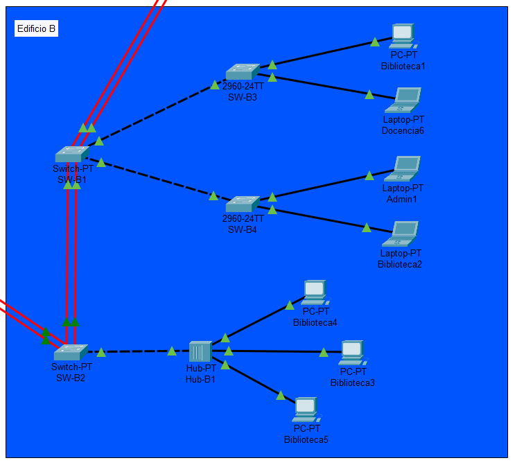

**Dispositivos:**
- SW-B1 (Switch-PT) — Switch de agregación
- SW-B2 (Switch-PT) — Switch de agregación con segmento legacy
- SW-B3 (2960-24TT) — Switch de acceso
- SW-B4 (2960-24TT) — Switch de acceso
- Hub-B1 (Hub-PT) — Segmento Legacy L1
- Biblioteca1, Biblioteca2, Biblioteca3, Biblioteca4, Biblioteca5, Admin1, Docencia6

**Conexiones internas:**

| Enlace | Medio | Tipo |
|--------|-------|------|
| SW-B1 → SW-B3 | FastEthernet (Fa0/1 ↔ Gi0/1) | Trunk 802.1Q |
| SW-B1 → SW-B4 | FastEthernet (Fa1/1 ↔ Gi0/1) | Trunk 802.1Q |
| SW-B2 → Hub-B1 | FastEthernet (Fa0/1 ↔ Fa0) | Access VLAN 33 |

---

### Edificio C

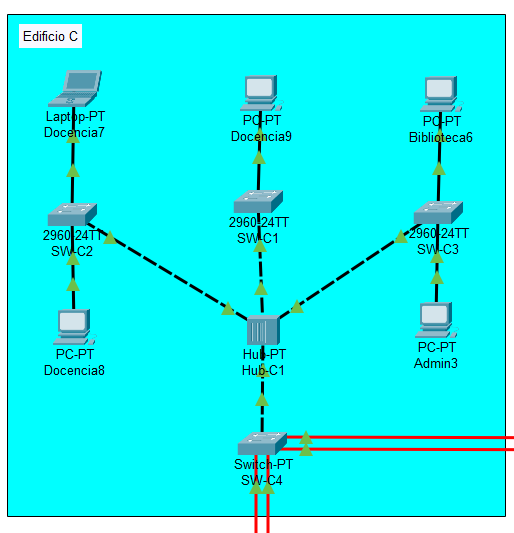

**Dispositivos:**
- SW-C4 (Switch-PT) — Punto de interconexión con campus
- Hub-C1 (Hub-PT) — Núcleo del edificio (capa 1)
- SW-C1 (2960-24TT) — Switch de acceso
- SW-C2 (2960-24TT) — Switch de acceso
- SW-C3 (2960-24TT) — Switch de acceso
- Docencia7, Docencia8, Docencia9, Biblioteca6, Admin3

**Conexiones internas:**

| Enlace | Medio | Tipo |
|--------|-------|------|
| SW-C4 → Hub-C1 | GigabitEthernet (Fa0/1 ↔ Fa0) | Trunk 802.1Q |
| Hub-C1 → SW-C1 | FastEthernet (Fa1 ↔ Fa0/1) | Trunk 802.1Q |
| Hub-C1 → SW-C2 | FastEthernet (Fa3 ↔ Fa0/1) | Trunk 802.1Q |
| Hub-C1 → SW-C3 | FastEthernet (Fa2 ↔ Fa0/1) | Trunk 802.1Q |

---

### Edificio D

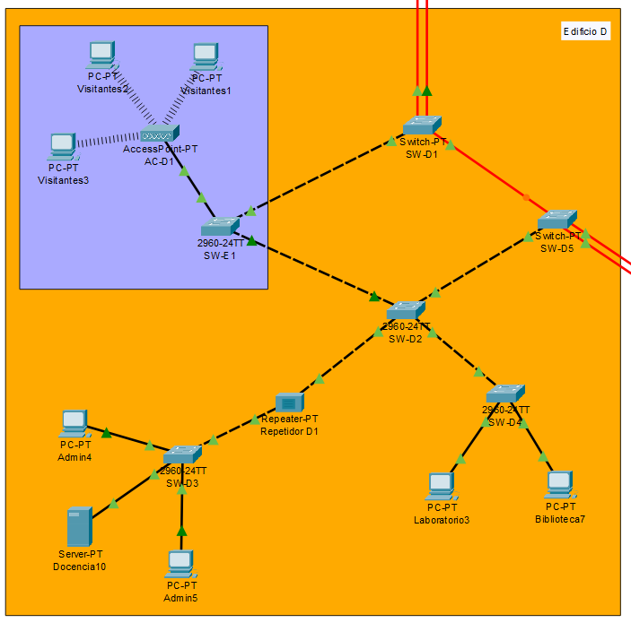

**Dispositivos:**
- SW-D1 (Switch-PT) — IDF Armario de Piso
- SW-D5 (Switch-PT) — Punto de salida hacia Edificio B
- SW-D2 (2960-24TT) — Switch de distribución
- SW-D3 (2960-24TT) — Switch de acceso
- SW-D4 (2960-24TT) — Switch de acceso
- SW-E1 (2960-24TT) — Switch VTP Transparente (área visitantes)
- Repetidor-D1 (Repeater-PT) — Extensión física del medio
- AC-D1 — Access Point visitantes (SSID: EdificioD)
- Visitantes1, Visitantes2, Visitantes3, Admin4, Admin5, Laboratorio3, Biblioteca7, Docencia10

**Conexiones internas:**

| Enlace | Medio | Tipo |
|--------|-------|------|
| SW-D1 → SW-E1 | FastEthernet (Fa0/1 ↔ Fa0/2) | Trunk 802.1Q |
| SW-D1 → SW-D5 | Fibra OM3 (Fa4/1 ↔ Fa5/1) | Trunk 802.1Q |
| SW-D2 → SW-E1 | FastEthernet (Fa0/2 ↔ Fa0/3) | Trunk 802.1Q |
| SW-D2 → SW-D5 | GigabitEthernet (Gi0/1 ↔ Fa0/1) | Trunk 802.1Q |
| SW-D2 → Repetidor-D1 | FastEthernet (Fa0/3 ↔ Eth0) | FastEthernet |
| Repetidor-D1 → SW-D3 | FastEthernet (Eth1 ↔ Fa0/1) | FastEthernet |
| SW-D2 → SW-D4 | FastEthernet (Fa0/4 ↔ Fa0/1) | Trunk 802.1Q |
| SW-E1 → AC-D1 | GigabitEthernet (Gi0/1) | Access VLAN 53 |

---

## Tabla de VLANs

| VLAN ID | Nombre | Área | Dirección de Red |
|---------|--------|------|-----------------|
| 13 | ADMIN | Administración | 192.168.13.0/24 |
| 23 | DOCENTES | Docencia | 192.168.23.0/24 |
| 33 | BIBLIOTECA | Biblioteca | 192.168.33.0/24 |
| 43 | LABORATORIO | Laboratorio de Redes | 192.168.43.0/24 |
| 53 | VISITANTE | Visitantes | 192.168.53.0/24 |

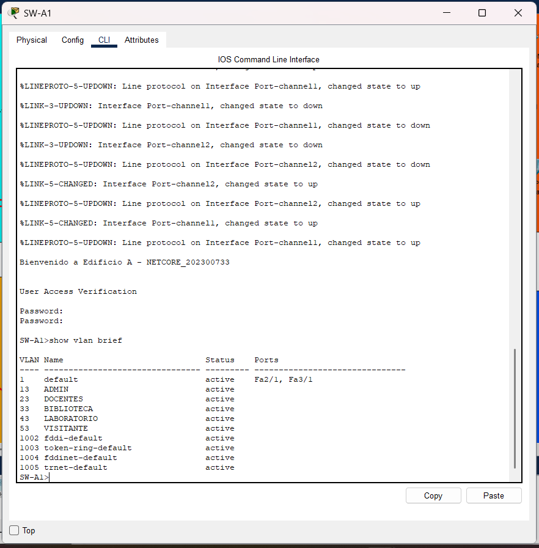

---

## Tabla de Dominios de Colisión

Un dominio de colisión es el segmento de red donde dos dispositivos pueden causar colisión si transmiten simultáneamente. Los switches separan dominios de colisión, los hubs y repetidores los comparten.

| Área | Dispositivo | Dominios de Colisión | Descripción |
|------|-------------|----------------------|-------------|
| Edificio A | SW-A2 | 3 | Admin2, Laboratorio4, Laboratorio2 |
| Edificio A | SW-A3 | 1 | Puerto hacia AC-A1 |
| Edificio B | Hub-B1 | 1 | Dominio compartido: Biblioteca3, 4 y 5 |
| Edificio B | SW-B3 | 2 | Biblioteca1, Docencia6 |
| Edificio B | SW-B4 | 2 | Admin1, Biblioteca2 |
| Edificio C | Hub-C1 | 1 | Dominio compartido: SW-C1, SW-C2, SW-C3 |
| Edificio D | Repetidor-D1 | 1 | Extiende dominio entre SW-D2 y SW-D3 |
| Edificio D | SW-D3 | 3 | Admin4, Admin5, Docencia10 |
| Edificio D | SW-D4 | 2 | Laboratorio3, Biblioteca7 |
---

## Tabla de Dominios de Broadcast

Un dominio de broadcast abarca todos los dispositivos que reciben un frame de broadcast. Las VLANs delimitan estos dominios.

| VLAN | Nombre | Dispositivos incluidos |
|------|--------|----------------------|
| VLAN 13 | ADMIN | Admin2 (Ed.A), Admin1 (Ed.B), Admin3 (Ed.C), Admin4, Admin5 (Ed.D) |
| VLAN 23 | DOCENTES | Docencia1,2,3 (Ed.A), Docencia6 (Ed.B), Docencia7,8,9 (Ed.C), Docencia10 (Ed.D) |
| VLAN 33 | BIBLIOTECA | Biblioteca1-5 (Ed.B), Biblioteca6 (Ed.C), Biblioteca7 (Ed.D) |
| VLAN 43 | LABORATORIO | Laboratorio2,4 (Ed.A), Laboratorio3 (Ed.D) |
| VLAN 53 | VISITANTE | Visitantes1, Visitantes2, Visitantes3 (Ed.D) |

---

## Jerarquía de Medios e Interfaces

| Nivel | Segmento | Medio | Interfaz | Ejemplo |
|-------|----------|-------|----------|---------|
| Interconexión de edificios | Entre switches de agregación | Fibra óptica OM3 (100Base-FX) | FastEthernet (módulo FFE) | SW-A1 ↔ SW-B1 |
| Distribución de edificio | Switches dentro del edificio | Cobre UTP Cat6 | GigabitEthernet | SW-B1 → SW-B3 |
| Acceso a usuarios | PCs, Laptops → switches de acceso | Cobre UTP Cat5e | FastEthernet | PC → SW-A2 |
| Segmento Legacy | Hub y Repetidor | Cobre UTP Cat5e | FastEthernet | Hub-B1, Repetidor-D1 |

---

## Configuración VTP

| Switch | Modo VTP | Dominio | Versión | Contraseña |
|--------|----------|---------|---------|------------|
| SW-A1 | Server | C3_NetCore | 2 | proyecto12026 |
| SW-A2, SW-A3 | Client | C3_NetCore | 2 | proyecto12026 |
| SW-B1, SW-B2, SW-B3, SW-B4 | Client | C3_NetCore | 2 | proyecto12026 |
| SW-C1, SW-C2, SW-C3, SW-C4 | Client | C3_NetCore | 2 | proyecto12026 |
| SW-D1, SW-D2, SW-D3, SW-D4, SW-D5 | Client | C3_NetCore | 2 | proyecto12026 |
| SW-E1 | Transparent | C3_NetCore | 2 | proyecto12026 |

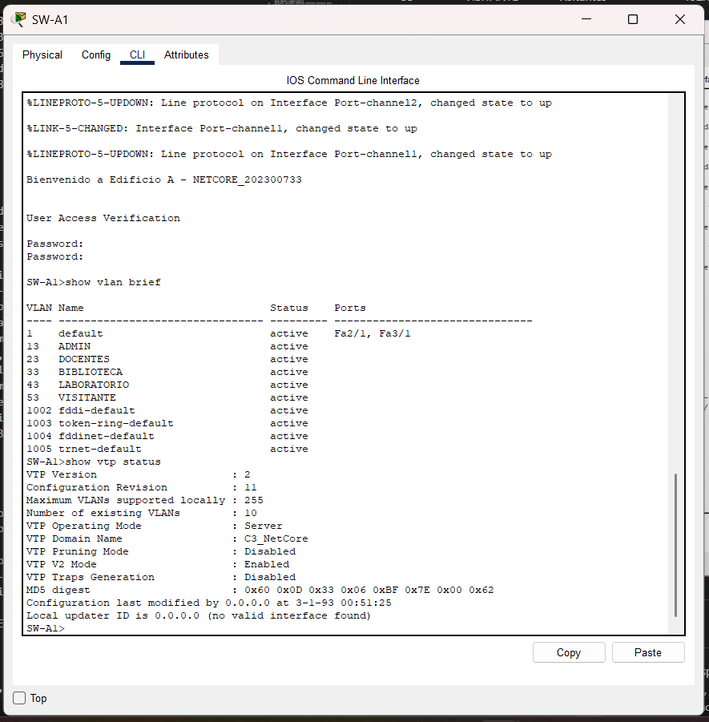

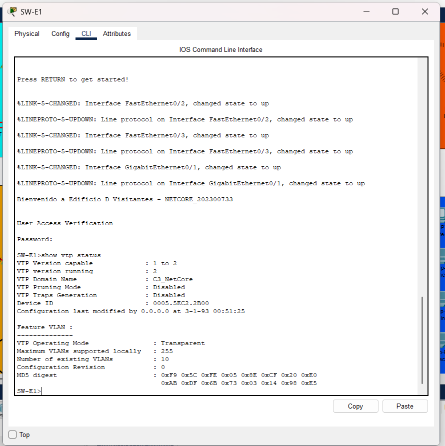

---

## Configuración STP

**Modo:** Rapid-PVST (carnet impar)  
**Root Bridge:** SW-A1 en todas las VLANs (prioridad 4096)

| VLAN | Root Bridge | Prioridad |
|------|-------------|-----------|
| VLAN 13 | SW-A1 | 4096 |
| VLAN 23 | SW-A1 | 4096 |
| VLAN 33 | SW-A1 | 4096 |
| VLAN 43 | SW-A1 | 4096 |
| VLAN 53 | SW-A1 | 4096 |

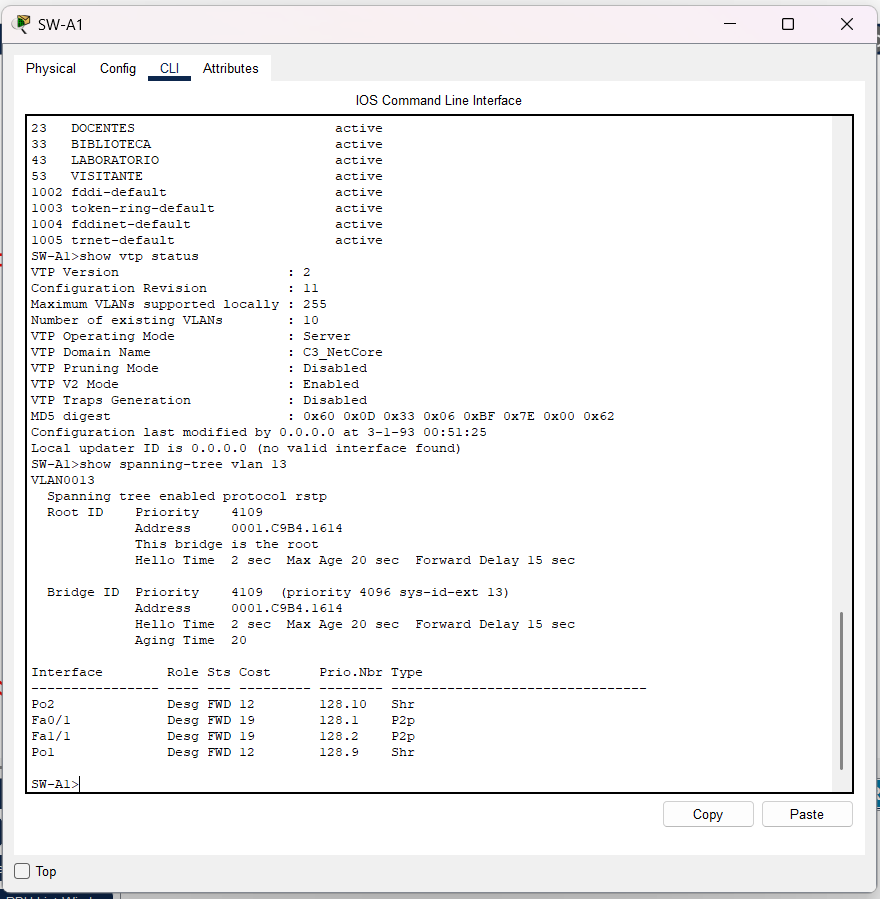

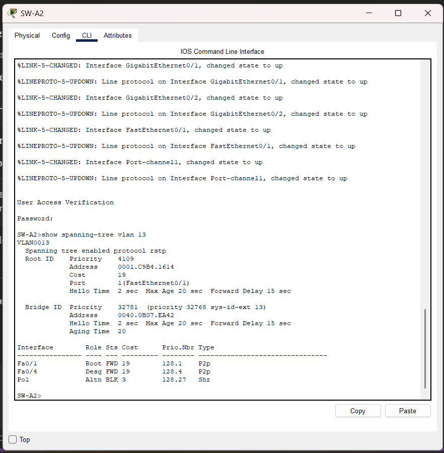

---

## Configuración EtherChannel

| Tipo | Enlace | Protocolo | Modo |
|------|--------|-----------|------|
| Inter-edificios (fibra) | SW-A1 ↔ SW-B1 | PAgP | desirable |
| Inter-edificios (fibra) | SW-A1 ↔ SW-C4 | PAgP | desirable |
| Inter-edificios (fibra) | SW-C4 ↔ SW-D1 | PAgP | desirable |
| Inter-edificios (fibra) | SW-D5 ↔ SW-B2 | PAgP | desirable |
| Inter-edificios (fibra) | SW-B1 ↔ SW-B2 | PAgP | desirable |
| Intra-edificio (UTP Cat6) | SW-A2 ↔ SW-A3 | LACP | active/passive |

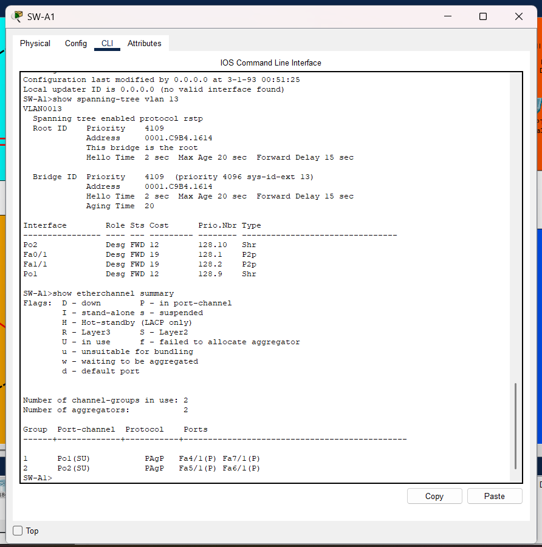

---

## Configuración de Trunks

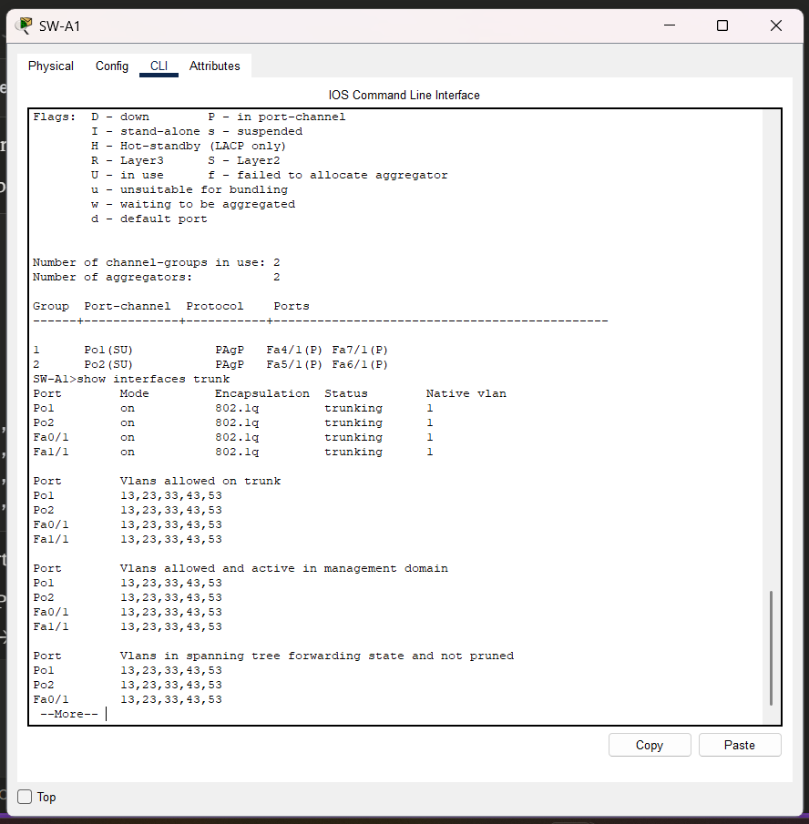

Los trunks 802.1Q se configuraron en todos los enlaces switch-to-switch con las VLANs permitidas 13, 23, 33, 43, 53.

---

## Tabla de Direccionamiento IP

### Edificio A

| Dispositivo | VLAN | Dirección IP | Máscara |
|-------------|------|--------------|---------|
| Admin2 | 13 - ADMIN | 192.168.13.1 | 255.255.255.0 |
| Laboratorio4 | 43 - LABORATORIO | 192.168.43.1 | 255.255.255.0 |
| Laboratorio2 | 43 - LABORATORIO | 192.168.43.2 | 255.255.255.0 |
| Docencia1 (Smartphone) | 23 - DOCENTES | 192.168.23.1 | 255.255.255.0 |
| Docencia2 (Laptop) | 23 - DOCENTES | 192.168.23.2 | 255.255.255.0 |
| Docencia3 (Laptop) | 23 - DOCENTES | 192.168.23.3 | 255.255.255.0 |

### Edificio B

| Dispositivo | VLAN | Dirección IP | Máscara |
|-------------|------|--------------|---------|
| Biblioteca1 | 33 - BIBLIOTECA | 192.168.33.1 | 255.255.255.0 |
| Docencia6 | 23 - DOCENTES | 192.168.23.4 | 255.255.255.0 |
| Admin1 | 13 - ADMIN | 192.168.13.2 | 255.255.255.0 |
| Biblioteca2 | 33 - BIBLIOTECA | 192.168.33.2 | 255.255.255.0 |
| Biblioteca3 | 33 - BIBLIOTECA | 192.168.33.3 | 255.255.255.0 |
| Biblioteca4 | 33 - BIBLIOTECA | 192.168.33.4 | 255.255.255.0 |
| Biblioteca5 | 33 - BIBLIOTECA | 192.168.33.5 | 255.255.255.0 |

### Edificio C

| Dispositivo | VLAN | Dirección IP | Máscara |
|-------------|------|--------------|---------|
| Admin3 | 13 - ADMIN | 192.168.13.3 | 255.255.255.0 |
| Biblioteca6 | 33 - BIBLIOTECA | 192.168.33.6 | 255.255.255.0 |
| Docencia9 | 23 - DOCENTES | 192.168.23.5 | 255.255.255.0 |
| Docencia7 | 23 - DOCENTES | 192.168.23.6 | 255.255.255.0 |
| Docencia8 | 23 - DOCENTES | 192.168.23.7 | 255.255.255.0 |

### Edificio D

| Dispositivo | VLAN | Dirección IP | Máscara |
|-------------|------|--------------|---------|
| Admin4 | 13 - ADMIN | 192.168.13.4 | 255.255.255.0 |
| Admin5 | 13 - ADMIN | 192.168.13.5 | 255.255.255.0 |
| Docencia10 | 23 - DOCENTES | 192.168.23.8 | 255.255.255.0 |
| Biblioteca7 | 33 - BIBLIOTECA | 192.168.33.7 | 255.255.255.0 |
| Laboratorio3 | 43 - LABORATORIO | 192.168.43.3 | 255.255.255.0 |
| Visitantes1 | 53 - VISITANTE | 192.168.53.1 | 255.255.255.0 |
| Visitantes2 | 53 - VISITANTE | 192.168.53.2 | 255.255.255.0 |
| Visitantes3 | 53 - VISITANTE | 192.168.53.3 | 255.255.255.0 |

---

## Comandos por Dispositivo

### SW-A1 — VTP Server / Root Bridge

```
hostname SW-A1
vtp mode server
vtp version 2
vtp domain C3_NetCore
vlan 13
 name ADMIN
vlan 23
 name DOCENTES
vlan 33
 name BIBLIOTECA
vlan 43
 name LABORATORIO
vlan 53
 name VISITANTE
spanning-tree mode rapid-pvst
spanning-tree vlan 13 priority 4096
spanning-tree vlan 23 priority 4096
spanning-tree vlan 33 priority 4096
spanning-tree vlan 43 priority 4096
spanning-tree vlan 53 priority 4096
interface FastEthernet0/1
 switchport mode trunk
 switchport trunk allowed vlan 13,23,33,43,53
interface FastEthernet1/1
 switchport mode trunk
 switchport trunk allowed vlan 13,23,33,43,53
interface range FastEthernet4/1, FastEthernet7/1
 channel-group 1 mode desirable
 switchport mode trunk
 switchport trunk allowed vlan 13,23,33,43,53
interface range FastEthernet5/1, FastEthernet6/1
 channel-group 2 mode desirable
 switchport mode trunk
 switchport trunk allowed vlan 13,23,33,43,53
interface port-channel 1
 switchport mode trunk
 switchport trunk allowed vlan 13,23,33,43,53
interface port-channel 2
 switchport mode trunk
 switchport trunk allowed vlan 13,23,33,43,53
banner motd #
Bienvenido a Edificio A - NETCORE_202300733
#
enable secret cisco123
line console 0
 password cisco123
 login
line vty 0 4
 password cisco123
 login
service password-encryption
vtp password proyecto12026
```

---

### SW-A2 — VTP Client / EtherChannel LACP

```
hostname SW-A2
vtp mode client
vtp domain C3_NetCore
spanning-tree mode rapid-pvst
interface FastEthernet0/1
 switchport mode trunk
 switchport trunk allowed vlan 13,23,33,43,53
interface range GigabitEthernet0/1, GigabitEthernet0/2
 channel-group 1 mode active
 switchport mode trunk
 switchport trunk allowed vlan 13,23,33,43,53
interface port-channel 1
 switchport mode trunk
 switchport trunk allowed vlan 13,23,33,43,53
interface FastEthernet0/4
 switchport mode access
 switchport access vlan 13
interface FastEthernet0/5
 switchport mode access
 switchport access vlan 43
interface FastEthernet0/6
 switchport mode access
 switchport access vlan 43
enable secret cisco123
line console 0
 password cisco123
 login
line vty 0 4
 password cisco123
 login
service password-encryption
vtp password proyecto12026
```

---

### SW-A3 — VTP Client / EtherChannel LACP

```
hostname SW-A3
vtp mode client
vtp domain C3_NetCore
spanning-tree mode rapid-pvst
interface FastEthernet0/1
 switchport mode trunk
 switchport trunk allowed vlan 13,23,33,43,53
interface range GigabitEthernet0/1, GigabitEthernet0/2
 channel-group 1 mode passive
 switchport mode trunk
 switchport trunk allowed vlan 13,23,33,43,53
interface port-channel 1
 switchport mode trunk
 switchport trunk allowed vlan 13,23,33,43,53
interface FastEthernet0/4
 switchport mode access
 switchport access vlan 23
enable secret cisco123
line console 0
 password cisco123
 login
line vty 0 4
 password cisco123
 login
service password-encryption
vtp password proyecto12026
```

---

### SW-B1 — VTP Client / EtherChannel PAgP

```
hostname SW-B1
vtp mode client
vtp domain C3_NetCore
spanning-tree mode rapid-pvst
interface FastEthernet0/1
 switchport mode trunk
 switchport trunk allowed vlan 13,23,33,43,53
interface FastEthernet1/1
 switchport mode trunk
 switchport trunk allowed vlan 13,23,33,43,53
interface range FastEthernet4/1, FastEthernet6/1
 channel-group 1 mode desirable
 switchport mode trunk
 switchport trunk allowed vlan 13,23,33,43,53
interface range FastEthernet5/1, FastEthernet7/1
 channel-group 2 mode desirable
 switchport mode trunk
 switchport trunk allowed vlan 13,23,33,43,53
interface port-channel 1
 switchport mode trunk
 switchport trunk allowed vlan 13,23,33,43,53
interface port-channel 2
 switchport mode trunk
 switchport trunk allowed vlan 13,23,33,43,53
banner motd #
Bienvenido a Edificio B - NETCORE_202300733
#
enable secret cisco123
line console 0
 password cisco123
 login
line vty 0 4
 password cisco123
 login
service password-encryption
vtp password proyecto12026
```

---

### SW-B2 — VTP Client / EtherChannel PAgP

```
hostname SW-B2
vtp mode client
vtp domain C3_NetCore
spanning-tree mode rapid-pvst
interface FastEthernet0/1
 switchport mode access
 switchport access vlan 33
interface range FastEthernet4/1, FastEthernet6/1
 channel-group 1 mode desirable
 switchport mode trunk
 switchport trunk allowed vlan 13,23,33,43,53
interface range FastEthernet5/1, FastEthernet7/1
 channel-group 2 mode desirable
 switchport mode trunk
 switchport trunk allowed vlan 13,23,33,43,53
interface port-channel 1
 switchport mode trunk
 switchport trunk allowed vlan 13,23,33,43,53
interface port-channel 2
 switchport mode trunk
 switchport trunk allowed vlan 13,23,33,43,53
enable secret cisco123
line console 0
 password cisco123
 login
line vty 0 4
 password cisco123
 login
service password-encryption
vtp password proyecto12026
```

---

### SW-B3 — VTP Client

```
hostname SW-B3
vtp mode client
vtp domain C3_NetCore
spanning-tree mode rapid-pvst
interface GigabitEthernet0/1
 switchport mode trunk
 switchport trunk allowed vlan 13,23,33,43,53
interface FastEthernet0/2
 switchport mode access
 switchport access vlan 33
interface FastEthernet0/3
 switchport mode access
 switchport access vlan 23
enable secret cisco123
line console 0
 password cisco123
 login
line vty 0 4
 password cisco123
 login
service password-encryption
vtp password proyecto12026
```

---

### SW-B4 — VTP Client

```
hostname SW-B4
vtp mode client
vtp domain C3_NetCore
spanning-tree mode rapid-pvst
interface GigabitEthernet0/1
 switchport mode trunk
 switchport trunk allowed vlan 13,23,33,43,53
interface FastEthernet0/2
 switchport mode access
 switchport access vlan 13
interface FastEthernet0/3
 switchport mode access
 switchport access vlan 33
enable secret cisco123
line console 0
 password cisco123
 login
line vty 0 4
 password cisco123
 login
service password-encryption
vtp password proyecto12026
```

---

### SW-C4 — VTP Client / EtherChannel PAgP

```
hostname SW-C4
vtp mode client
vtp domain C3_NetCore
spanning-tree mode rapid-pvst
interface FastEthernet0/1
 switchport mode trunk
 switchport trunk allowed vlan 13,23,33,43,53
interface range FastEthernet4/1, FastEthernet6/1
 channel-group 1 mode desirable
 switchport mode trunk
 switchport trunk allowed vlan 13,23,33,43,53
interface range FastEthernet5/1, FastEthernet7/1
 channel-group 2 mode desirable
 switchport mode trunk
 switchport trunk allowed vlan 13,23,33,43,53
interface port-channel 1
 switchport mode trunk
 switchport trunk allowed vlan 13,23,33,43,53
interface port-channel 2
 switchport mode trunk
 switchport trunk allowed vlan 13,23,33,43,53
banner motd #
Bienvenido a Edificio C - NETCORE_202300733
#
enable secret cisco123
line console 0
 password cisco123
 login
line vty 0 4
 password cisco123
 login
service password-encryption
vtp password proyecto12026
```

---

### SW-C1, SW-C2, SW-C3 — VTP Client

```
hostname SW-C1  ! Cambiar según corresponda

vtp mode client
vtp domain C3_NetCore
spanning-tree mode rapid-pvst
interface FastEthernet0/1
 switchport mode trunk
 switchport trunk allowed vlan 13,23,33,43,53
enable secret cisco123
line console 0
 password cisco123
 login
line vty 0 4
 password cisco123
 login
service password-encryption
vtp password proyecto12026
```

**SW-C1:** `Fa0/2 access vlan 23`  
**SW-C2:** `Fa0/2 access vlan 23` y `Fa0/3 access vlan 23`  
**SW-C3:** `Fa0/2 access vlan 13` y `Fa0/3 access vlan 33`

---

### SW-D1 — VTP Client / EtherChannel PAgP

```
hostname SW-D1
vtp mode client
vtp domain C3_NetCore
spanning-tree mode rapid-pvst
interface FastEthernet0/1
 switchport mode trunk
 switchport trunk allowed vlan 13,23,33,43,53
interface FastEthernet4/1
 switchport mode trunk
 switchport trunk allowed vlan 13,23,33,43,53
interface range FastEthernet5/1, FastEthernet6/1
 channel-group 1 mode desirable
 switchport mode trunk
 switchport trunk allowed vlan 13,23,33,43,53
interface port-channel 1
 switchport mode trunk
 switchport trunk allowed vlan 13,23,33,43,53
banner motd #
Bienvenido a Edificio D - NETCORE_202300733
#
enable secret cisco123
line console 0
 password cisco123
 login
line vty 0 4
 password cisco123
 login
service password-encryption
vtp password proyecto12026
```

---

### SW-D5 — VTP Client / EtherChannel PAgP

```
hostname SW-D5
vtp mode client
vtp domain C3_NetCore
spanning-tree mode rapid-pvst
interface FastEthernet0/1
 switchport mode trunk
 switchport trunk allowed vlan 13,23,33,43,53
interface FastEthernet5/1
 switchport mode trunk
 switchport trunk allowed vlan 13,23,33,43,53
interface range FastEthernet4/1, FastEthernet6/1
 channel-group 1 mode desirable
 switchport mode trunk
 switchport trunk allowed vlan 13,23,33,43,53
interface port-channel 1
 switchport mode trunk
 switchport trunk allowed vlan 13,23,33,43,53
enable secret cisco123
line console 0
 password cisco123
 login
line vty 0 4
 password cisco123
 login
service password-encryption
vtp password proyecto12026
```

---

### SW-D2 — VTP Client

```
hostname SW-D2
vtp mode client
vtp domain C3_NetCore
spanning-tree mode rapid-pvst
interface GigabitEthernet0/1
 switchport mode trunk
 switchport trunk allowed vlan 13,23,33,43,53
interface FastEthernet0/2
 switchport mode trunk
 switchport trunk allowed vlan 13,23,33,43,53
interface FastEthernet0/3
 switchport mode trunk
 switchport trunk allowed vlan 13,23,33,43,53
interface FastEthernet0/4
 switchport mode trunk
 switchport trunk allowed vlan 13,23,33,43,53
enable secret cisco123
line console 0
 password cisco123
 login
line vty 0 4
 password cisco123
 login
service password-encryption
vtp password proyecto12026
```

---

### SW-D3 — VTP Client

```
hostname SW-D3
vtp mode client
vtp domain C3_NetCore
spanning-tree mode rapid-pvst
interface FastEthernet0/1
 switchport mode trunk
 switchport trunk allowed vlan 13,23,33,43,53
interface FastEthernet0/2
 switchport mode access
 switchport access vlan 13
interface FastEthernet0/3
 switchport mode access
 switchport access vlan 23
interface FastEthernet0/4
 switchport mode access
 switchport access vlan 13
enable secret cisco123
line console 0
 password cisco123
 login
line vty 0 4
 password cisco123
 login
service password-encryption
vtp password proyecto12026
```

---

### SW-D4 — VTP Client

```
hostname SW-D4
vtp mode client
vtp domain C3_NetCore
spanning-tree mode rapid-pvst
interface FastEthernet0/1
 switchport mode trunk
 switchport trunk allowed vlan 13,23,33,43,53
interface FastEthernet0/2
 switchport mode access
 switchport access vlan 43
interface FastEthernet0/3
 switchport mode access
 switchport access vlan 33
enable secret cisco123
line console 0
 password cisco123
 login
line vty 0 4
 password cisco123
 login
service password-encryption
vtp password proyecto12026
```

---

### SW-E1 — VTP Transparent

```
hostname SW-E1
vtp mode transparent
vtp version 2
vtp domain C3_NetCore
spanning-tree mode rapid-pvst
interface FastEthernet0/2
 switchport mode trunk
 switchport trunk allowed vlan 13,23,33,43,53
interface FastEthernet0/3
 switchport mode trunk
 switchport trunk allowed vlan 13,23,33,43,53
interface GigabitEthernet0/1
 switchport mode access
 switchport access vlan 53
vlan 53
 name VISITANTE
banner motd #
Bienvenido a Edificio D Visitantes - NETCORE_202300733
#
enable secret cisco123
line console 0
 password cisco123
 login
line vty 0 4
 password cisco123
 login
service password-encryption
vtp password proyecto12026
```

---

## Pruebas de Conectividad

### Capturas exitosas

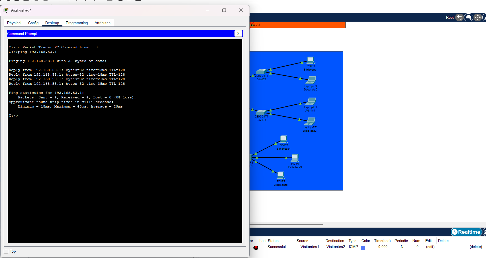
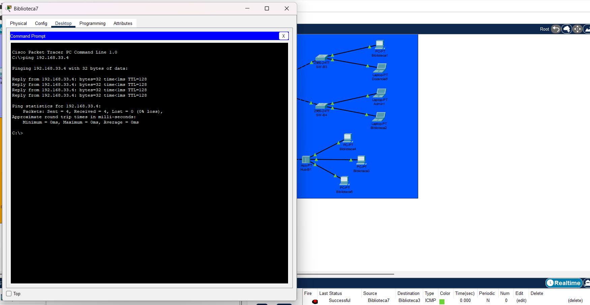
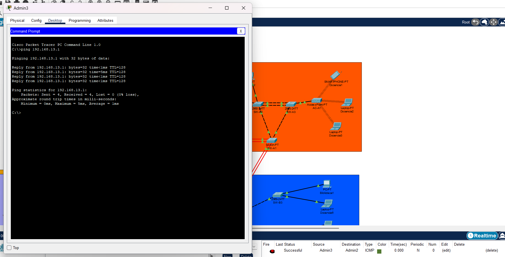
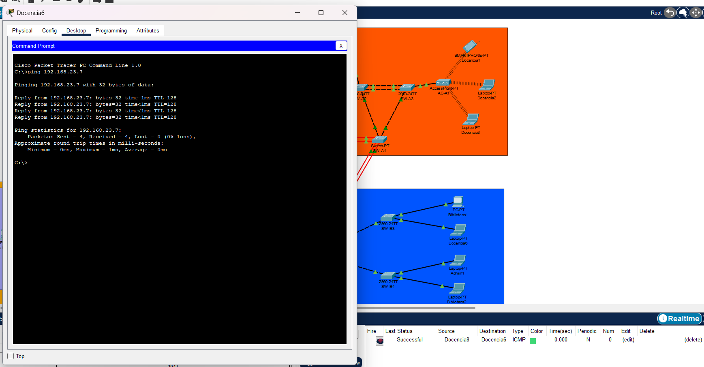
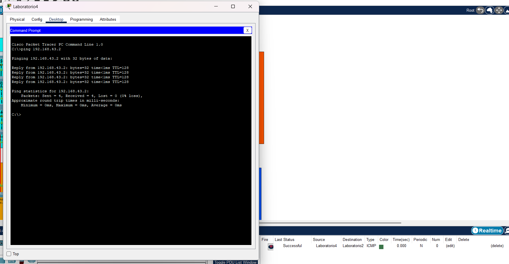

### Capturas fallidas

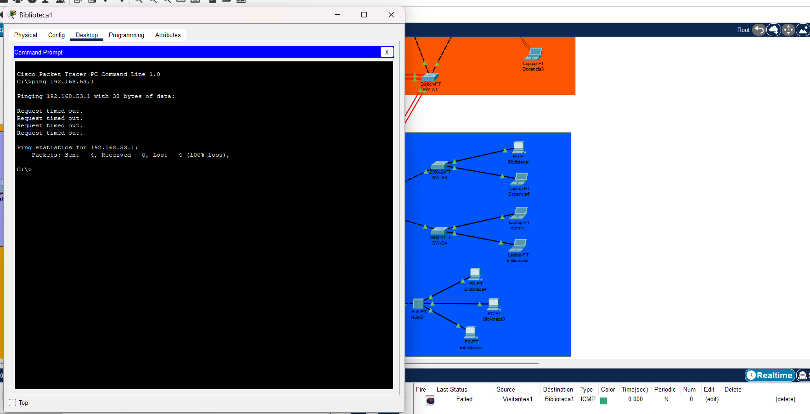
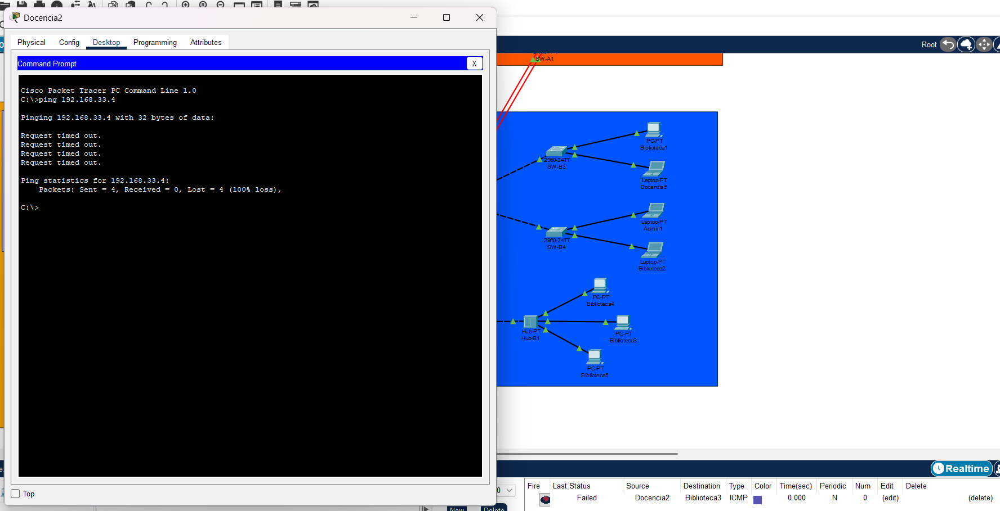
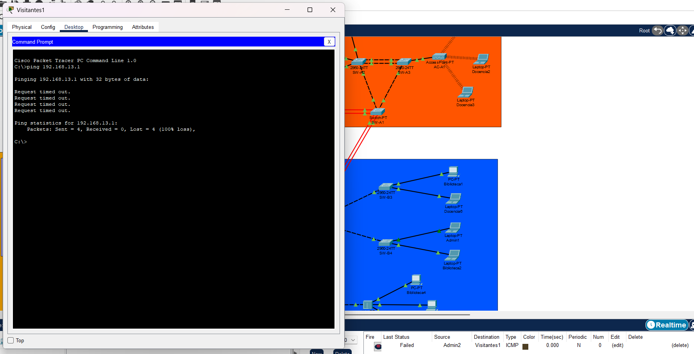
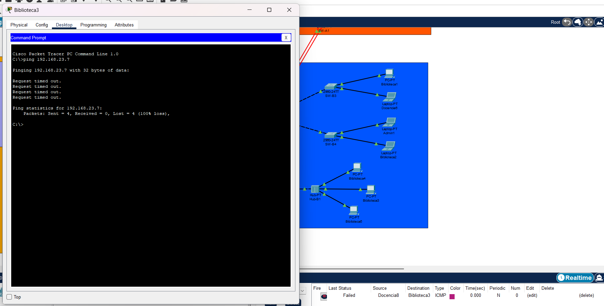
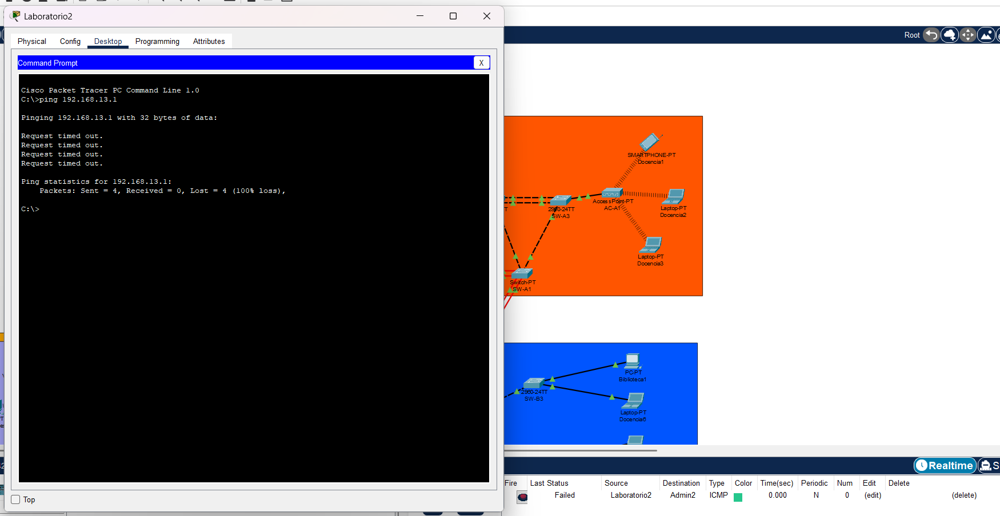

---

## Presupuesto Estimado

| Equipo | Cantidad | Precio Unit. (USD) | Total (USD) |
|--------|----------|--------------------|-------------|
| Switch Cisco 2960-24TT | 13 | $500.00 | $6,500.00 |
| Switch-PT equivalente industrial | 6 | $800.00 | $4,800.00 |
| Módulo fibra PT-SWITCH-NM-1FFE | 12 | $150.00 | $1,800.00 |
| Cable UTP Cat5e (100 metros) | 5 | $50.00 | $250.00 |
| Cable UTP Cat6 (100 metros) | 8 | $80.00 | $640.00 |
| Cable fibra óptica OM3 (100 metros) | 6 | $300.00 | $1,800.00 |
| Conectores RJ-45 (caja 100 unidades) | 3 | $15.00 | $45.00 |
| Conectores fibra LC/SC | 20 | $10.00 | $200.00 |
| Hub-PT | 2 | $50.00 | $100.00 |
| Repetidor-PT | 1 | $80.00 | $80.00 |
| Access Point | 2 | $120.00 | $240.00 |
| **TOTAL** | | | **$16,455.00** |

---

## Conclusión

El proyecto NetCore Academy permitió implementar de forma práctica los conceptos fundamentales de las capas física y de enlace de datos del modelo OSI. A través del diseño y configuración de la red del campus se lograron los siguientes aprendizajes:

**Capa 1 — Física:** Se evidenció la diferencia entre medios de transmisión, usando fibra óptica OM3 para el backbone inter-edificios y cobre UTP Cat5e/Cat6 para distribución y acceso. La inclusión de hubs y repetidores permitió observar el comportamiento del dominio de colisión compartido frente a la conmutación de capa 2.

**Capa 2 — Enlace de datos:** La implementación de VLANs segmentó el tráfico en 5 dominios de broadcast independientes, eliminando la saturación de la red plana original. VTP simplificó la administración centralizada de VLANs desde SW-A1. Rapid-PVST garantizó la prevención de bucles con SW-A1 como Root Bridge en todas las VLANs. EtherChannel agregó los enlaces físicos de fibra en canales lógicos con mayor ancho de banda y redundancia.

La combinación de estas tecnologías resultó en una red escalable, segura, redundante y correctamente segmentada, cumpliendo con todos los objetivos del proyecto NetCore Academy.
