# PROYECTO 2 — Red Nacional de Coordinación SE-CONRED

---

**Institución:** Universidad San Carlos de Guatemala  
**Facultad:** Ingeniería en Ciencias y Sistemas  
**Curso:** Redes de Computadoras 1  
**Autor:** Ángel Rafael Barrios González  
**Carnet:** 202300733  
**Fecha:** 29 de abril de 2026  

---

## Índice

1. [Introducción](#introducción)
2. [Topología General](#topología-general)
3. [Topología por Sede](#topología-por-sede)
4. [Tabla de VLANs](#tabla-de-vlans)
5. [Tabla de Subnetting por Sede](#tabla-de-subnetting-por-sede)
6. [Configuración VTP](#configuración-vtp)
7. [Configuración Spanning Tree](#configuración-spanning-tree)
8. [Configuración HSRP — Sede Oriente](#configuración-hsrp--sede-oriente)
9. [Configuración del Backbone](#configuración-del-backbone)
10. [Configuraciones CLI por Dispositivo](#configuraciones-cli-por-dispositivo)
11. [Pruebas de Conectividad](#pruebas-de-conectividad)
12. [Justificación de Topologías](#justificación-de-topologías)
13. [Conclusión](#conclusión)

---

## Introducción

El presente proyecto corresponde al diseño, configuración y simulación de una infraestructura de red multisede para la **Secretaría Ejecutiva de la Coordinadora Nacional para la Reducción de Desastres (SE-CONRED)**, desarrollado como parte del curso de Redes de Computadoras 1 de la Universidad San Carlos de Guatemala.

La solución implementa una red nacional que interconecta cuatro sedes operativas — Occidente, Norte, Oriente y Central — mediante un backbone nacional propio que garantiza conectividad, redundancia y escalabilidad. Las tecnologías implementadas incluyen:

- **VLANs** para segmentación lógica del tráfico por departamento en cada sede
- **VTP** para propagación centralizada de VLANs dentro de cada área
- **Trunking 802.1Q** para transporte de múltiples VLANs en enlaces inter-switch
- **Router-on-a-Stick** para enrutamiento inter-VLAN en todas las sedes
- **Rapid PVST+** para control de redundancia en Sede Norte y Central
- **HSRP** para alta disponibilidad del gateway en Sede Oriente
- **OSPF, EIGRP, RIP y rutas estáticas** como protocolos de enrutamiento del backbone
- **Redistribución de rutas** entre dominios de enrutamiento distintos
- **VLSM** para subnetting eficiente en todas las sedes

La implementación se realizó en **Cisco Packet Tracer**, utilizando routers Cisco 2911 y switches Cisco 2960-24TT.

**Valores de identificación del estudiante:**
- **Y = 3** (último dígito del carnet)
- **XX = 33** (dos últimos dígitos del carnet)

---

## Topología General

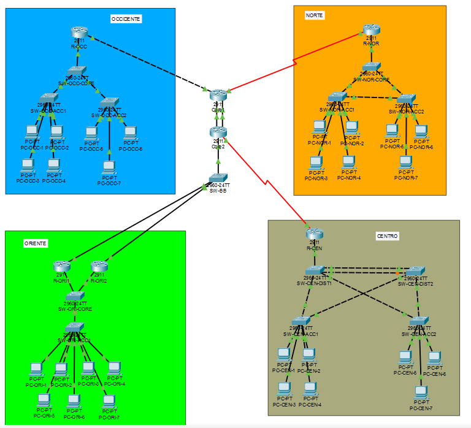

La topología completa interconecta las cuatro sedes mediante un backbone nacional estructurado de la siguiente manera:

```
         OCCIDENTE                    NORTE
         [R-OCC] ─── OSPF ──────── [R-NOR]
              \                       /
            10.0.0.5/6           10.0.0.9/10
                \                   /
               [Core1] ══════ [Core2]
               10.0.0.1         10.0.0.2
               10.0.0.13        10.0.0.14
                                    \
                                  EIGRP
                                    \
                                  [SW-BB]
                                  /     \
                            [R-ORI1]  [R-ORI2]
                                ORIENTE
                                    
              [Core2] ─── Serial ─── [R-CEN]
                        Estáticas     CENTRAL
```

**Dispositivos del backbone:**

| Dispositivo | Modelo | Rol |
|-------------|--------|-----|
| Core1 | Cisco 2911 | Router núcleo 1 — redistribuye OSPF, RIP |
| Core2 | Cisco 2911 | Router núcleo 2 — redistribuye EIGRP, estáticas |
| R-OCC | Cisco 2911 | Router de borde Sede Occidente (OSPF) |
| R-NOR | Cisco 2911 | Router de borde Sede Norte (RIP) |
| R-ORI1 | Cisco 2911 | Router de borde Sede Oriente 1 (EIGRP, HSRP Active) |
| R-ORI2 | Cisco 2911 | Router de borde Sede Oriente 2 (EIGRP, HSRP Standby) |
| R-CEN | Cisco 2911 | Router de borde Sede Central (rutas estáticas) |
| SW-BB | Cisco 2960-24TT | Switch de zona EIGRP |

---

## Topología por Sede

### Sede Occidente

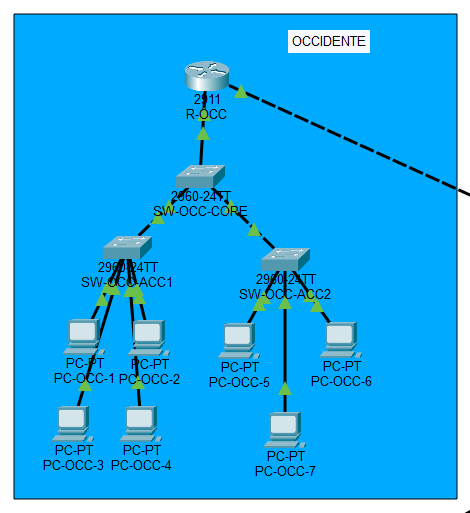

**Topología elegida: Estrella jerárquica**

**Dispositivos:**
- R-OCC (Cisco 2911) — Router de borde, gateway inter-VLAN mediante Router-on-a-Stick
- SW-OCC-CORE (2960-24TT) — Switch principal, VTP Server
- SW-OCC-ACC1 (2960-24TT) — Switch de acceso, VTP Client
- SW-OCC-ACC2 (2960-24TT) — Switch de acceso, VTP Client
- PC-OCC-1 a PC-OCC-7 — Dispositivos finales (7 equipos)

**Distribución de PCs por VLAN:**

| PC | VLAN | Departamento |
|----|------|-------------|
| PC-OCC-1 | 13 | Operaciones |
| PC-OCC-2 | 13 | Operaciones |
| PC-OCC-3 | 23 | Administración |
| PC-OCC-4 | 23 | Administración |
| PC-OCC-5 | 33 | Seguridad |
| PC-OCC-6 | 33 | Seguridad |
| PC-OCC-7 | 43 | Inventario |

**Conexiones internas:**

| Enlace | Puerto A | Puerto B | Tipo |
|--------|----------|----------|------|
| R-OCC ↔ SW-OCC-CORE | G0/1 | Fa0/24 | Trunk 802.1Q |
| SW-OCC-CORE ↔ SW-OCC-ACC1 | Fa0/1 | Fa0/1 | Trunk 802.1Q |
| SW-OCC-CORE ↔ SW-OCC-ACC2 | Fa0/2 | Fa0/1 | Trunk 802.1Q |
| SW-OCC-ACC1 ↔ PC-OCC-1/2/3/4 | Fa0/2–Fa0/5 | Fa0 | Access |
| SW-OCC-ACC2 ↔ PC-OCC-5/6/7 | Fa0/2–Fa0/4 | Fa0 | Access |

---

### Sede Norte

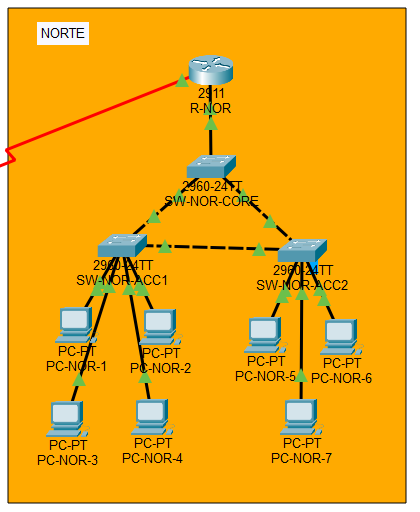

**Topología elegida: Triángulo jerárquico con redundancia (Rapid PVST+)**

**Dispositivos:**
- R-NOR (Cisco 2911) — Router de borde, gateway inter-VLAN
- SW-NOR-CORE (2960-24TT) — Switch principal, VTP Server, Root Bridge
- SW-NOR-ACC1 (2960-24TT) — Switch de acceso, VTP Client
- SW-NOR-ACC2 (2960-24TT) — Switch de acceso, VTP Client
- PC-NOR-1 a PC-NOR-7 — Dispositivos finales (7 equipos)

**Distribución de PCs por VLAN:**

| PC | VLAN | Departamento |
|----|------|-------------|
| PC-NOR-1 | 13 | Operaciones |
| PC-NOR-2 | 13 | Operaciones |
| PC-NOR-3 | 23 | Administración |
| PC-NOR-4 | 23 | Administración |
| PC-NOR-5 | 33 | Seguridad |
| PC-NOR-6 | 33 | Seguridad |
| PC-NOR-7 | 43 | Inventario |

**Conexiones internas:**

| Enlace | Puerto A | Puerto B | Tipo |
|--------|----------|----------|------|
| R-NOR ↔ SW-NOR-CORE | G0/0 | Fa0/24 | Trunk 802.1Q |
| SW-NOR-CORE ↔ SW-NOR-ACC1 | Fa0/1 | Fa0/1 | Trunk 802.1Q |
| SW-NOR-CORE ↔ SW-NOR-ACC2 | Fa0/2 | Fa0/1 | Trunk 802.1Q |
| SW-NOR-ACC1 ↔ SW-NOR-ACC2 | Fa0/2 | Fa0/2 | Trunk 802.1Q — **enlace redundante** |
| SW-NOR-ACC1 ↔ PC-NOR-1/2/3/4 | Fa0/3–Fa0/6 | Fa0 | Access |
| SW-NOR-ACC2 ↔ PC-NOR-5/6/7 | Fa0/3–Fa0/5 | Fa0 | Access |

> El enlace entre SW-NOR-ACC1 y SW-NOR-ACC2 crea el camino redundante gestionado por Rapid PVST+. SW-NOR-CORE es el Root Bridge con prioridad 4096.

---

### Sede Oriente

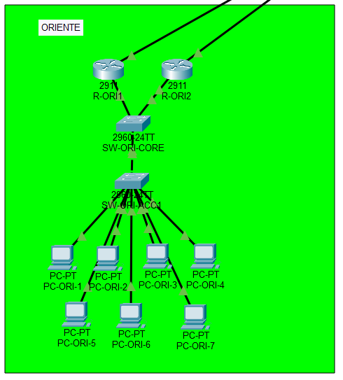

**Topología elegida: Estrella con doble enlace de borde (HSRP)**

**Dispositivos:**
- R-ORI1 (Cisco 2911) — Router de borde 1, HSRP Active (prioridad 110)
- R-ORI2 (Cisco 2911) — Router de borde 2, HSRP Standby (prioridad 90)
- SW-ORI-CORE (2960-24TT) — Switch principal, VTP Server
- SW-ORI-ACC1 (2960-24TT) — Switch de acceso, VTP Client
- PC-ORI-1 a PC-ORI-7 — Dispositivos finales (7 equipos)

**Distribución de PCs por VLAN:**

| PC | VLAN | Departamento |
|----|------|-------------|
| PC-ORI-1 | 53 | Atención Regional |
| PC-ORI-2 | 53 | Atención Regional |
| PC-ORI-3 | 23 | Administración |
| PC-ORI-4 | 23 | Administración |
| PC-ORI-5 | 33 | Seguridad |
| PC-ORI-6 | 33 | Seguridad |
| PC-ORI-7 | 43 | Inventario |

**Conexiones internas:**

| Enlace | Puerto A | Puerto B | Tipo |
|--------|----------|----------|------|
| R-ORI1 ↔ SW-ORI-CORE | G0/1 | Fa0/23 | Trunk 802.1Q |
| R-ORI2 ↔ SW-ORI-CORE | G0/1 | Fa0/24 | Trunk 802.1Q |
| SW-ORI-CORE ↔ SW-ORI-ACC1 | Fa0/1 | Fa0/1 | Trunk 802.1Q |
| SW-ORI-ACC1 ↔ PC-ORI-1..7 | Fa0/2–Fa0/8 | Fa0 | Access |

---

### Sede Central

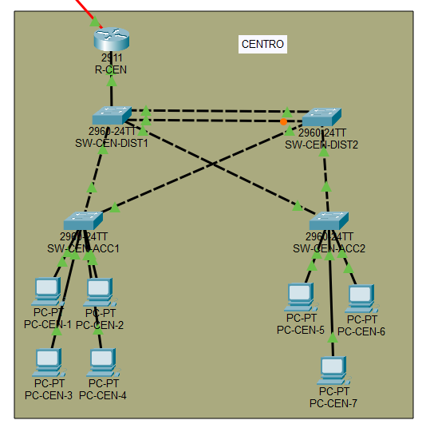

**Topología elegida: Malla parcial jerárquica redundante**

**Dispositivos:**
- R-CEN (Cisco 2911) — Router de borde, gateway inter-VLAN
- SW-CEN-DIST1 (2960-24TT) — Switch de distribución 1, VTP Server, **Root Bridge** (prioridad 4096)
- SW-CEN-DIST2 (2960-24TT) — Switch de distribución 2, VTP Client (prioridad 8192)
- SW-CEN-ACC1 (2960-24TT) — Switch de acceso, VTP Client
- SW-CEN-ACC2 (2960-24TT) — Switch de acceso, VTP Client
- PC-CEN-1 a PC-CEN-7 — Dispositivos finales (7 equipos)

**Distribución de PCs por VLAN:**

| PC | VLAN | Departamento |
|----|------|-------------|
| PC-CEN-1 | 23 | Administración |
| PC-CEN-2 | 23 | Administración |
| PC-CEN-3 | 33 | Seguridad |
| PC-CEN-4 | 63 | Monitoreo y Control |
| PC-CEN-5 | 63 | Monitoreo y Control |
| PC-CEN-6 | 73 | Soporte |
| PC-CEN-7 | 83 | Servicios Críticos |

**Conexiones internas:**

| Enlace | Puerto A | Puerto B | Tipo |
|--------|----------|----------|------|
| R-CEN ↔ SW-CEN-DIST1 | G0/0 | Fa0/24 | Trunk 802.1Q |
| SW-CEN-DIST1 ↔ SW-CEN-DIST2 | Fa0/1 | Fa0/1 | Trunk 802.1Q |
| SW-CEN-DIST1 ↔ SW-CEN-DIST2 | Fa0/2 | Fa0/2 | Trunk 802.1Q — **enlace redundante** |
| SW-CEN-DIST1 ↔ SW-CEN-ACC1 | Fa0/3 | Fa0/1 | Trunk 802.1Q |
| SW-CEN-DIST2 ↔ SW-CEN-ACC1 | Fa0/3 | Fa0/2 | Trunk 802.1Q — **malla** |
| SW-CEN-DIST1 ↔ SW-CEN-ACC2 | Fa0/4 | Fa0/1 | Trunk 802.1Q |
| SW-CEN-DIST2 ↔ SW-CEN-ACC2 | Fa0/4 | Fa0/2 | Trunk 802.1Q — **malla** |
| SW-CEN-ACC1 ↔ PC-CEN-1/2/3/4 | Fa0/3–Fa0/6 | Fa0 | Access |
| SW-CEN-ACC2 ↔ PC-CEN-5/6/7 | Fa0/3–Fa0/5 | Fa0 | Access |

> **Root Bridge:** SW-CEN-DIST1 es el Root Bridge principal con prioridad 4096. SW-CEN-DIST2 tiene prioridad 8192 como respaldo. Esto garantiza que el tráfico tome el camino más eficiente a través de DIST1 en condiciones normales.

---

## Tabla de VLANs

| ID VLAN | Nombre | Sedes donde aparece |
|---------|--------|-------------------|
| 13 | Operaciones | Occidente, Norte |
| 23 | Administracion | Occidente, Norte, Oriente, Central |
| 33 | Seguridad | Occidente, Norte, Oriente, Central |
| 43 | Inventario | Occidente, Norte, Oriente |
| 53 | AtencionRegional | Oriente |
| 63 | MonitoreoControl | Central |
| 73 | Soporte | Central |
| 83 | ServiciosCriticos | Central |

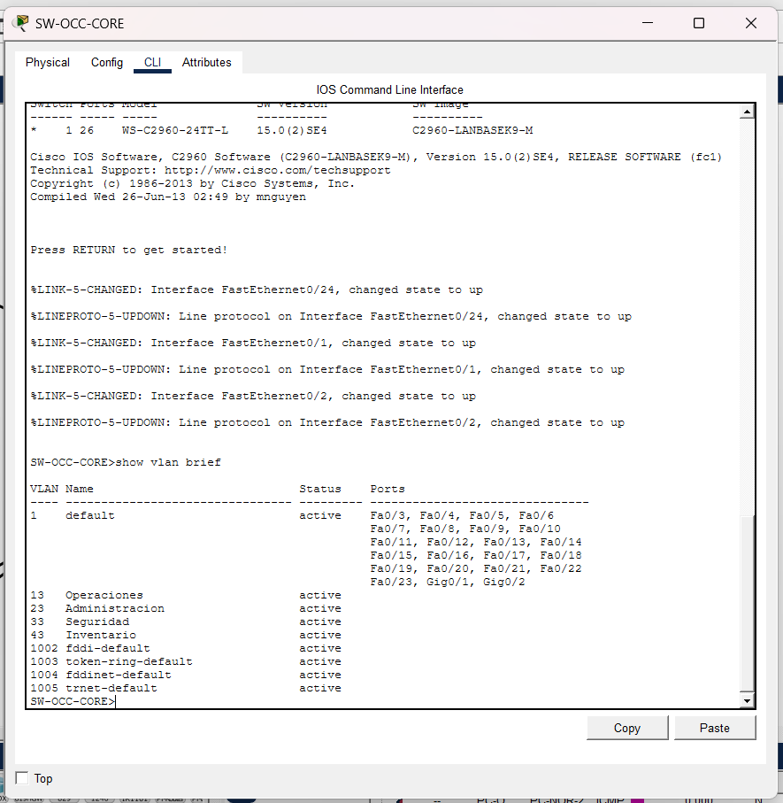
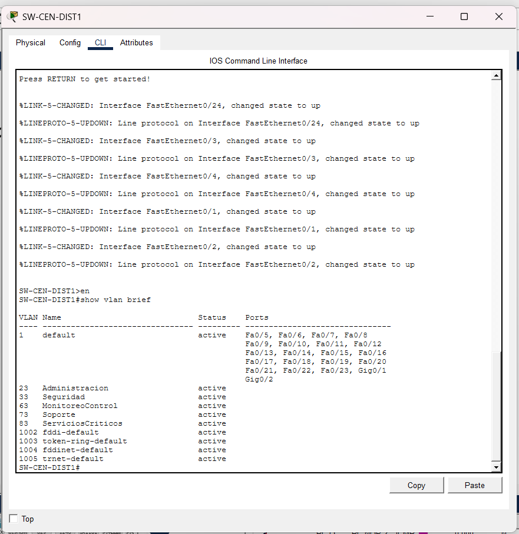
---

## Tabla de Subnetting por Sede

### Sede Occidente — Red base: 192.168.10.0/24 (VLSM)

| VLAN | Nombre | Hosts requeridos | Subred | Máscara | Gateway | Rango usable | Broadcast |
|------|--------|-----------------|--------|---------|---------|-------------|-----------|
| 43 | Inventario | 55 | 192.168.10.0 | /26 — 255.255.255.192 | 192.168.10.1 | .2 — .62 | 192.168.10.63 |
| 13 | Operaciones | 40 | 192.168.10.64 | /26 — 255.255.255.192 | 192.168.10.65 | .66 — .126 | 192.168.10.127 |
| 23 | Administración | 18 | 192.168.10.128 | /27 — 255.255.255.224 | 192.168.10.129 | .130 — .158 | 192.168.10.159 |
| 33 | Seguridad | 8 | 192.168.10.160 | /28 — 255.255.255.240 | 192.168.10.161 | .162 — .174 | 192.168.10.175 |

### Sede Norte — Red base: 192.168.20.0/24 (VLSM)

| VLAN | Nombre | Hosts requeridos | Subred | Máscara | Gateway | Rango usable | Broadcast |
|------|--------|-----------------|--------|---------|---------|-------------|-----------|
| 13 | Operaciones | 30 | 192.168.20.0 | /27 — 255.255.255.224 | 192.168.20.1 | .2 — .30 | 192.168.20.31 |
| 43 | Inventario | 15 | 192.168.20.32 | /27 — 255.255.255.224 | 192.168.20.33 | .34 — .62 | 192.168.20.63 |
| 23 | Administración | 12 | 192.168.20.64 | /28 — 255.255.255.240 | 192.168.20.65 | .66 — .78 | 192.168.20.79 |
| 33 | Seguridad | 10 | 192.168.20.80 | /28 — 255.255.255.240 | 192.168.20.81 | .82 — .94 | 192.168.20.95 |

### Sede Oriente — Red base: 192.168.30.0/24 (VLSM)

> Los gateways son IPs virtuales HSRP, no IPs reales de ningún router.

| VLAN | Nombre | Hosts requeridos | Subred | Máscara | Gateway virtual (HSRP) | Rango usable | Broadcast |
|------|--------|-----------------|--------|---------|----------------------|-------------|-----------|
| 53 | Atención Regional | 28 | 192.168.30.0 | /27 — 255.255.255.224 | 192.168.30.1 | .2 — .30 | 192.168.30.31 |
| 43 | Inventario | 21 | 192.168.30.32 | /27 — 255.255.255.224 | 192.168.30.33 | .34 — .62 | 192.168.30.63 |
| 23 | Administración | 19 | 192.168.30.64 | /27 — 255.255.255.224 | 192.168.30.65 | .66 — .94 | 192.168.30.95 |
| 33 | Seguridad | 8 | 192.168.30.96 | /28 — 255.255.255.240 | 192.168.30.97 | .98 — .110 | 192.168.30.111 |

### Sede Central — Red base: 192.168.40.0/24 (VLSM)

| VLAN | Nombre | Hosts requeridos | Subred | Máscara | Gateway | Rango usable | Broadcast |
|------|--------|-----------------|--------|---------|---------|-------------|-----------|
| 63 | Monitoreo y Control | 45 | 192.168.40.0 | /26 — 255.255.255.192 | 192.168.40.1 | .2 — .62 | 192.168.40.63 |
| 23 | Administración | 20 | 192.168.40.64 | /27 — 255.255.255.224 | 192.168.40.65 | .66 — .94 | 192.168.40.95 |
| 83 | Servicios Críticos | 16 | 192.168.40.96 | /27 — 255.255.255.224 | 192.168.40.97 | .98 — .126 | 192.168.40.127 |
| 73 | Soporte | 10 | 192.168.40.128 | /28 — 255.255.255.240 | 192.168.40.129 | .130 — .142 | 192.168.40.143 |
| 33 | Seguridad | 9 | 192.168.40.144 | /28 — 255.255.255.240 | 192.168.40.145 | .146 — .158 | 192.168.40.159 |

### Backbone — Red base: 10.0.0.0/24 (VLSM)

| Enlace | Protocolo | Subred | Máscara | IP dispositivo A | IP dispositivo B |
|--------|-----------|--------|---------|-----------------|-----------------|
| Core1 G0/0 ↔ Core2 G0/0 | Enlace primario | 10.0.0.0 | /30 | Core1 = 10.0.0.1 | Core2 = 10.0.0.2 |
| Core1 G0/1 ↔ Core2 G0/1 | Enlace redundante | 10.0.0.12 | /30 | Core1 = 10.0.0.13 | Core2 = 10.0.0.14 |
| Core1 G0/2 ↔ R-OCC G0/0 | OSPF | 10.0.0.4 | /30 | Core1 = 10.0.0.5 | R-OCC = 10.0.0.6 |
| Core1 Se0/0/0 ↔ R-NOR Se0/0/0 | RIP | 10.0.0.8 | /30 | Core1 = 10.0.0.9 | R-NOR = 10.0.0.10 |
| Core2 G0/2 ↔ SW-BB | EIGRP | 10.0.0.16 | /29 | Core2 = 10.0.0.17 | — |
| SW-BB ↔ R-ORI1 G0/0 | EIGRP | 10.0.0.16 | /29 | R-ORI1 = 10.0.0.18 | — |
| SW-BB ↔ R-ORI2 G0/0 | EIGRP | 10.0.0.16 | /29 | R-ORI2 = 10.0.0.19 | — |
| Core2 Se0/0/0 ↔ R-CEN Se0/0/0 | Estáticas | 10.0.0.24 | /30 | Core2 = 10.0.0.25 | R-CEN = 10.0.0.26 |

---

## Configuración VTP

| Switch | Modo VTP | Dominio | Contraseña |
|--------|----------|---------|------------|
| SW-OCC-CORE | Server | OCCIDENTE | cisco123 |
| SW-OCC-ACC1 | Client | OCCIDENTE | cisco123 |
| SW-OCC-ACC2 | Client | OCCIDENTE | cisco123 |
| SW-NOR-CORE | Server | NORTE | cisco123 |
| SW-NOR-ACC1 | Client | NORTE | cisco123 |
| SW-NOR-ACC2 | Client | NORTE | cisco123 |
| SW-ORI-CORE | Server | ORIENTE | cisco123 |
| SW-ORI-ACC1 | Client | ORIENTE | cisco123 |
| SW-CEN-DIST1 | Server | CENTRAL | cisco123 |
| SW-CEN-DIST2 | Client | CENTRAL | cisco123 |
| SW-CEN-ACC1 | Client | CENTRAL | cisco123 |
| SW-CEN-ACC2 | Client | CENTRAL | cisco123 |

---

## Configuración Spanning Tree

Rapid PVST+ se implementa en Sede Norte y Sede Central donde existen caminos redundantes de capa 2.

| Sede | Switch | Rol | Prioridad | VLANs |
|------|--------|-----|-----------|-------|
| Norte | SW-NOR-CORE | Root Bridge | 4096 | 13, 23, 33, 43 |
| Norte | SW-NOR-ACC1 | No Root | default | 13, 23, 33, 43 |
| Norte | SW-NOR-ACC2 | No Root | default | 13, 23, 33, 43 |
| Central | SW-CEN-DIST1 | **Root Bridge principal** | 4096 | 23, 33, 63, 73, 83 |
| Central | SW-CEN-DIST2 | Root Bridge secundario | 8192 | 23, 33, 63, 73, 83 |
| Central | SW-CEN-ACC1 | No Root | default | 23, 33, 63, 73, 83 |
| Central | SW-CEN-ACC2 | No Root | default | 23, 33, 63, 73, 83 |

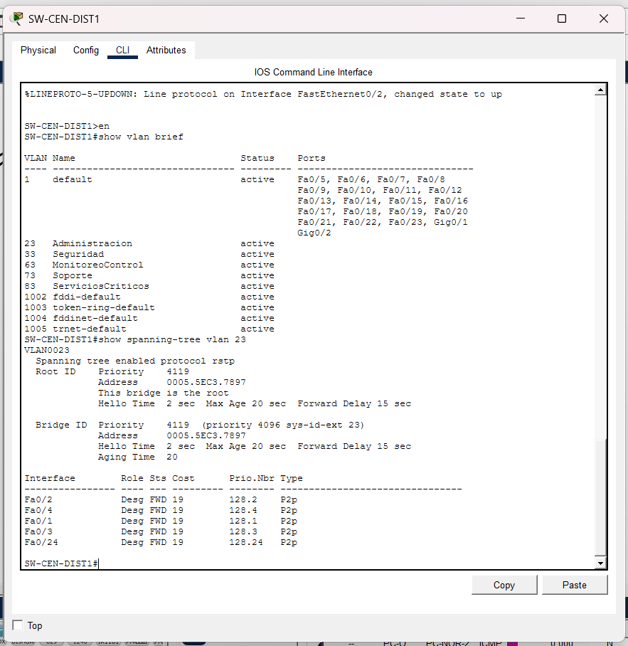

---

## Configuración HSRP — Sede Oriente

HSRP garantiza que las PCs de Oriente siempre tengan un gateway funcional aunque caiga un router de borde.

| VLAN | IP Virtual (Gateway PCs) | IP Real R-ORI1 (Active) | IP Real R-ORI2 (Standby) | Prioridad R-ORI1 | Prioridad R-ORI2 |
|------|--------------------------|------------------------|--------------------------|-----------------|-----------------|
| 53 | 192.168.30.1 | 192.168.30.2 | 192.168.30.3 | 110 | 90 |
| 43 | 192.168.30.33 | 192.168.30.34 | 192.168.30.35 | 110 | 90 |
| 23 | 192.168.30.65 | 192.168.30.66 | 192.168.30.67 | 110 | 90 |
| 33 | 192.168.30.97 | 192.168.30.98 | 192.168.30.99 | 110 | 90 |

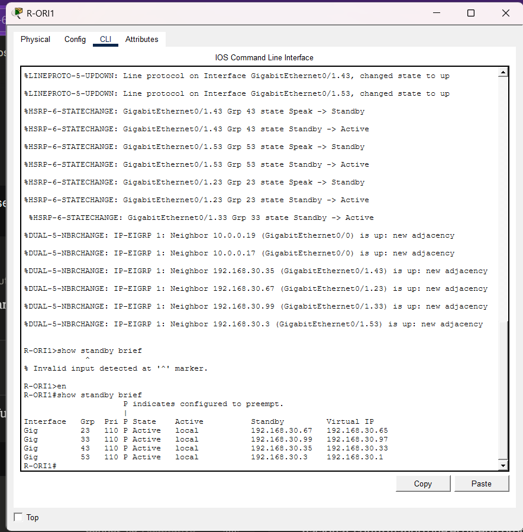

---

## Configuración del Backbone

### Protocolos de enrutamiento por zona

| Zona | Protocolo | Dispositivos involucrados |
|------|-----------|--------------------------|
| Core1 ↔ R-OCC | OSPF área 0 | Core1, R-OCC |
| Core1 ↔ R-NOR | RIP v2 | Core1, R-NOR |
| Core2 ↔ R-ORI1, R-ORI2 | EIGRP AS 1 | Core2, SW-BB, R-ORI1, R-ORI2 |
| Core2 ↔ R-CEN | Rutas estáticas | Core2, R-CEN |
| Core1 ↔ Core2 | OSPF (redistribución) | Core1, Core2 |

### Puntos de redistribución

| Router | Redistribuye hacia OSPF | Redistribuye hacia EIGRP | Redistribuye hacia RIP |
|--------|------------------------|--------------------------|------------------------|
| Core1 | RIP, EIGRP, estáticas | — | OSPF, EIGRP, estáticas |
| Core2 | EIGRP, estáticas | OSPF, RIP, estáticas | — |

### Medios físicos utilizados

| Enlace | Medio físico | Justificación |
|--------|-------------|---------------|
| Core1 ↔ R-NOR | Serial | Enlace WAN de largo alcance hacia región norte |
| Core2 ↔ R-CEN | Serial | Enlace WAN hacia sede central |
| Core1 ↔ R-OCC | Copper (representa fibra óptica) | Enlace de alta velocidad regional |
| Core2 ↔ SW-BB | Ethernet (Copper) | Enlace de distribución zona EIGRP |

> Nota: Packet Tracer 2911 no dispone de puertos de fibra nativos. El enlace Core1–R-OCC está documentado como fibra óptica en el diseño lógico y se representa con cable copper en la simulación.

---

## Configuraciones CLI por Dispositivo

### Core1

```
hostname Core1

interface g0/0
 ip address 10.0.0.1 255.255.255.252
 no shutdown

interface g0/1
 ip address 10.0.0.13 255.255.255.252
 no shutdown

interface g0/2
 ip address 10.0.0.5 255.255.255.252
 no shutdown

interface se0/0/0
 ip address 10.0.0.9 255.255.255.252
 clock rate 64000
 no shutdown

router ospf 1
 network 10.0.0.0 0.0.0.3 area 0
 network 10.0.0.4 0.0.0.3 area 0
 network 10.0.0.12 0.0.0.3 area 0
 redistribute rip subnets
 redistribute eigrp 1 subnets
 redistribute static subnets

router rip
 version 2
 network 10.0.0.8
 no auto-summary
 redistribute ospf 1 metric 5
 redistribute eigrp 1 metric 5
 redistribute static metric 5
```

---

### Core2

```
hostname Core2

interface g0/0
 ip address 10.0.0.2 255.255.255.252
 no shutdown

interface g0/1
 ip address 10.0.0.14 255.255.255.252
 no shutdown

interface g0/2
 ip address 10.0.0.17 255.255.255.248
 no shutdown

interface se0/0/0
 ip address 10.0.0.25 255.255.255.252
 clock rate 64000
 no shutdown

router ospf 1
 network 10.0.0.0 0.0.0.3 area 0
 network 10.0.0.12 0.0.0.3 area 0
 redistribute eigrp 1 subnets
 redistribute static subnets

router eigrp 1
 network 10.0.0.16 0.0.0.7
 no auto-summary
 redistribute ospf 1 metric 10000 100 255 1 1500
 redistribute rip metric 10000 100 255 1 1500
 redistribute static metric 10000 100 255 1 1500

ip route 0.0.0.0 0.0.0.0 10.0.0.26
ip route 192.168.40.0 255.255.255.192 10.0.0.26
ip route 192.168.40.64 255.255.255.224 10.0.0.26
ip route 192.168.40.96 255.255.255.224 10.0.0.26
ip route 192.168.40.128 255.255.255.240 10.0.0.26
ip route 192.168.40.144 255.255.255.240 10.0.0.26
```

---

### R-OCC

```
hostname R-OCC

interface g0/0
 ip address 10.0.0.6 255.255.255.252
 no shutdown

interface g0/1
 no shutdown

interface g0/1.13
 encapsulation dot1q 13
 ip address 192.168.10.65 255.255.255.192

interface g0/1.23
 encapsulation dot1q 23
 ip address 192.168.10.129 255.255.255.224

interface g0/1.33
 encapsulation dot1q 33
 ip address 192.168.10.161 255.255.255.240

interface g0/1.43
 encapsulation dot1q 43
 ip address 192.168.10.1 255.255.255.192

router ospf 1
 network 10.0.0.4 0.0.0.3 area 0
 network 192.168.10.0 0.0.0.63 area 0
 network 192.168.10.64 0.0.0.63 area 0
 network 192.168.10.128 0.0.0.31 area 0
 network 192.168.10.160 0.0.0.15 area 0
```

---

### SW-OCC-CORE

```
hostname SW-OCC-CORE
vtp mode server
vtp domain OCCIDENTE
vtp password cisco123

vlan 13
 name Operaciones
vlan 23
 name Administracion
vlan 33
 name Seguridad
vlan 43
 name Inventario

spanning-tree mode rapid-pvst

interface fa0/1
 switchport mode trunk
 switchport trunk allowed vlan 13,23,33,43

interface fa0/2
 switchport mode trunk
 switchport trunk allowed vlan 13,23,33,43

interface fa0/24
 switchport mode trunk
 switchport trunk allowed vlan 13,23,33,43
```

---

### R-ORI1 — HSRP Active

```
hostname R-ORI1

interface g0/0
 ip address 10.0.0.18 255.255.255.248
 no shutdown

interface g0/1
 no shutdown

interface g0/1.53
 encapsulation dot1q 53
 ip address 192.168.30.2 255.255.255.224
 standby 53 ip 192.168.30.1
 standby 53 priority 110
 standby 53 preempt

interface g0/1.43
 encapsulation dot1q 43
 ip address 192.168.30.34 255.255.255.224
 standby 43 ip 192.168.30.33
 standby 43 priority 110
 standby 43 preempt

interface g0/1.23
 encapsulation dot1q 23
 ip address 192.168.30.66 255.255.255.224
 standby 23 ip 192.168.30.65
 standby 23 priority 110
 standby 23 preempt

interface g0/1.33
 encapsulation dot1q 33
 ip address 192.168.30.98 255.255.255.240
 standby 33 ip 192.168.30.97
 standby 33 priority 110
 standby 33 preempt

router eigrp 1
 network 10.0.0.16 0.0.0.7
 network 192.168.30.0 0.0.0.31
 network 192.168.30.32 0.0.0.31
 network 192.168.30.64 0.0.0.31
 network 192.168.30.96 0.0.0.15
 no auto-summary
```

---

### R-CEN

```
hostname R-CEN

interface se0/0/0
 ip address 10.0.0.26 255.255.255.252
 no shutdown

interface g0/0
 no shutdown

interface g0/0.63
 encapsulation dot1q 63
 ip address 192.168.40.1 255.255.255.192

interface g0/0.23
 encapsulation dot1q 23
 ip address 192.168.40.65 255.255.255.224

interface g0/0.83
 encapsulation dot1q 83
 ip address 192.168.40.97 255.255.255.224

interface g0/0.73
 encapsulation dot1q 73
 ip address 192.168.40.129 255.255.255.240

interface g0/0.33
 encapsulation dot1q 33
 ip address 192.168.40.145 255.255.255.240

ip route 0.0.0.0 0.0.0.0 10.0.0.25
```

---

## Pruebas de Conectividad

### Pruebas internas por sede — Inter-VLAN

#### Sede Occidente (desde PC-OCC-1, VLAN 13)

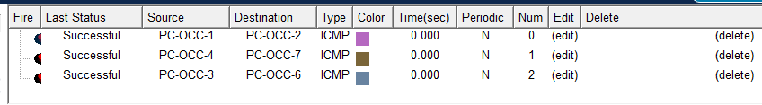

#### Sede Norte (desde PC-NOR-1, VLAN 13)

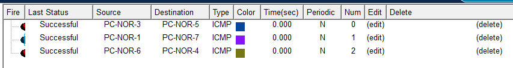

#### Sede Oriente (desde PC-ORI-1, VLAN 53)

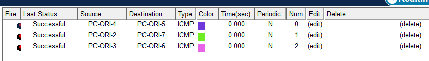

#### Sede Central (desde PC-CEN-1, VLAN 23)

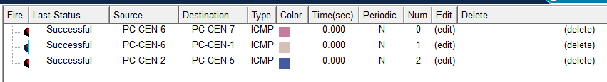

---

### Pruebas entre sedes — Backbone

#### Desde Occidente hacia otras sedes (PC-OCC-1)

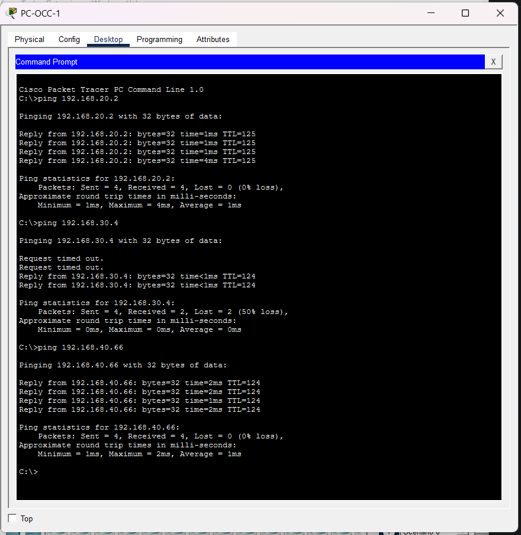

#### Desde Norte hacia otras sedes (PC-NOR-1)

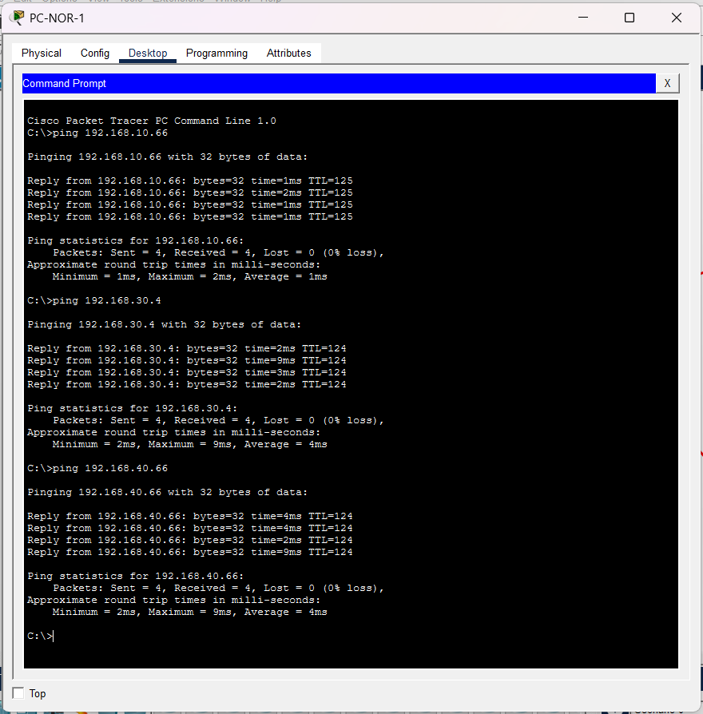

#### Desde Oriente hacia otras sedes (PC-ORI-1)

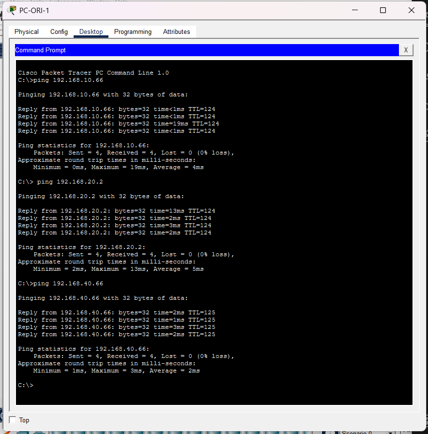

#### Desde Central hacia otras sedes (PC-CEN-1)

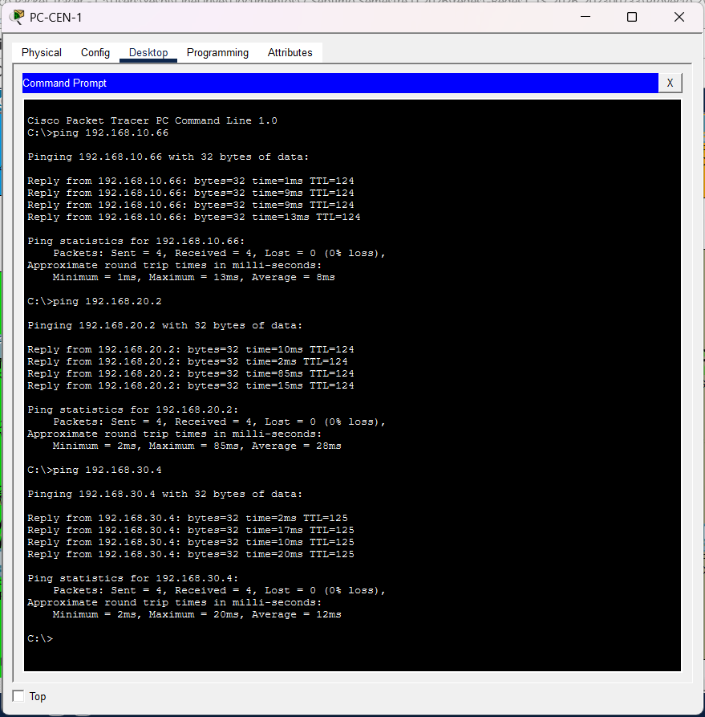

---

## Justificación de Topologías

### Sede Occidente — Estrella jerárquica

Se eligió la topología de estrella jerárquica porque la sede Occidente es un centro regional logístico que requiere administración centralizada y facilidad de mantenimiento. Un switch principal (SW-OCC-CORE) concentra toda la administración de VLANs y VTP, mientras los switches de acceso distribuyen los equipos por departamento. Esta topología permite agregar nuevos switches de acceso sin modificar la estructura existente, respondiendo directamente al requisito de crecimiento ordenado de la sede. La ausencia de enlaces redundantes se justifica porque Occidente no tiene requisito explícito de tolerancia a fallos en la capa 2 interna.

### Sede Norte — Triángulo con Rapid PVST+

Se eligió una topología en triángulo entre los tres switches porque la sede Norte es un centro de monitoreo y coordinación remota con requisito explícito de caminos alternos y tolerancia a fallos. El enlace entre SW-NOR-ACC1 y SW-NOR-ACC2 crea el segundo camino de capa 2. Rapid PVST+ gestiona este camino redundante bloqueando el puerto apropiado para evitar loops, y lo activa automáticamente si falla el enlace principal. Esto elimina el punto único de falla sin necesidad de intervención manual.

### Sede Oriente — Estrella con HSRP

Se eligió una topología con dos routers de borde conectados al mismo switch core porque el enunciado indica explícitamente que Oriente cuenta con dos routers disponibles y que el gateway de las VLANs debe permanecer funcional ante la caída de uno. HSRP resuelve esto creando una IP virtual compartida entre R-ORI1 (Active) y R-ORI2 (Standby). Las PCs configuran su gateway hacia la IP virtual, que siempre responde independientemente de cuál router esté activo. R-ORI1 tiene prioridad 110 y preempt activado, garantizando que retoma el rol Active cuando se recupera.

### Sede Central — Malla parcial jerárquica

Se eligió la malla parcial porque la sede Central es la sede principal de servicios nacionales con requisito de múltiples caminos para servicios críticos y alta disponibilidad. Los dos switches de distribución (DIST1 y DIST2) están conectados entre sí con dos enlaces y cada uno conecta a ambos switches de acceso, creando cuatro caminos posibles entre cualquier par de equipos. Rapid PVST+ gestiona los loops y SW-CEN-DIST1 es el Root Bridge con prioridad 4096, garantizando que el tráfico tome el camino más eficiente en condiciones normales. Esta topología elimina por completo los puntos únicos de falla entre los equipos de distribución.

### Backbone — Multiprotocolo con redistribución

El backbone fue diseñado con segmentos de enrutamiento diferenciados para cumplir el requisito de demostrar dominio de múltiples protocolos. OSPF se usa hacia Occidente por su eficiencia en topologías grandes. RIP hacia Norte como protocolo simple de vector distancia. EIGRP hacia Oriente aprovechando su convergencia rápida en la zona de dos routers. Rutas estáticas hacia Central por ser el segmento más predecible y controlado. Los dos núcleos Core1 y Core2 funcionan como puntos de redistribución donde las rutas de un dominio se inyectan en los demás, permitiendo comunicación total entre todas las sedes.

---

## Conclusión

El proyecto permitió implementar de forma práctica una infraestructura de red multisede compleja para SE-CONRED, integrando tecnologías de capa 2 y capa 3 del modelo OSI en un escenario institucional realista.

Se lograron los objetivos técnicos planteados: segmentación mediante VLANs con VTP, enrutamiento inter-VLAN por Router-on-a-Stick en todas las sedes, redundancia de capa 2 con Rapid PVST+ en Norte y Central, alta disponibilidad del gateway con HSRP en Oriente, y un backbone multiprotocolo con OSPF, EIGRP, RIP y rutas estáticas con redistribución entre dominios.

La conectividad completa entre las cuatro sedes fue verificada mediante pruebas de ping exitosas tanto a nivel interno de cada sede como a través del backbone nacional, confirmando que el diseño propuesto cumple con todos los requerimientos operativos del proyecto.
